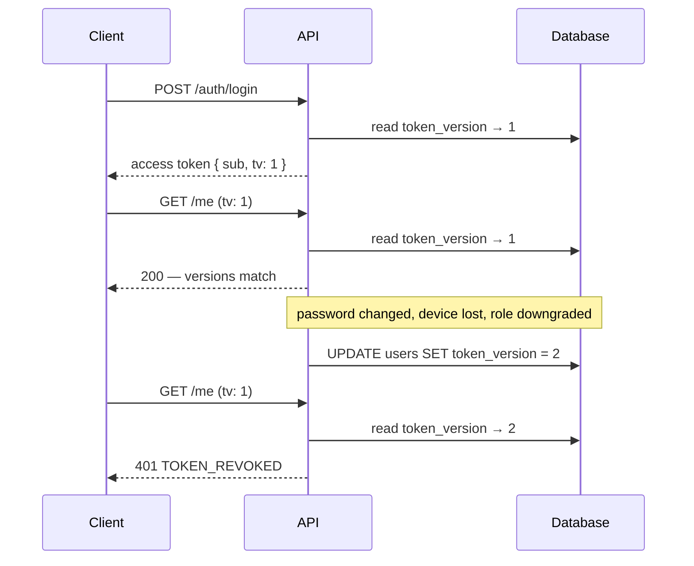

# revocable-jwt

Stateless access tokens you can actually revoke. Plus the one-time codes,
rate limiting and credential hashing that a phone-first login needs.

Zero dependencies. WebCrypto only, so it runs on Deno, Node 18+, Bun and
Cloudflare Workers. Storage is a port you implement; a Postgres schema and an
in-memory adapter ship with it.

> **Reference implementation.** Read it, take what you need, understand the
> trade-offs it documents. It is not a maintained security product, and it has
> had no external audit. If you drop it into something holding real accounts,
> you own the result.

```
deno task test     # 31 tests
deno task check    # typecheck
deno run --allow-net --allow-env examples/server.ts
```

---

## The problem

A JWT is a signed claim that carries its own authority. That is the whole
appeal, and it is also the whole difficulty: **there is no way to take one
back.** Until it expires, whoever holds it is that user. Change their password,
notice a stolen device, downgrade their role: the token in the attacker's hand
keeps working.

The usual answers each give something up:

| Approach | What it costs |
|---|---|
| Very short TTLs | Shrinks the window, never closes it. More refresh traffic, worse offline behaviour. |
| Blocklist of revoked token ids | A lookup per request, on a set that grows forever and must be pruned. |
| Session table | You have rebuilt sessions. The statelessness you paid for is gone. |

## The mechanism

Put a version number in the token. Keep the current version on the user row.
Compare them at verification.



The token is never touched. Its signature still verifies; it simply carries a
number that is no longer current. One `UPDATE` invalidates every token that
user holds, on every device, instantly.

**Cost:** one indexed read per verification, on a row most endpoints load
anyway. If that read is unacceptable to you, this is not your design.

**Benefit:** O(1) revocation. Nothing to prune, no per-token state, no growth.

### What it deliberately does not give you

Version-based revocation is all or nothing per user. You cannot sign one
device out and leave the others alone, because every live token carries the
same number.

That is why the refresh tokens are a table. The two mechanisms cover different
needs and neither is sufficient alone:

| | Access token `tv` | Refresh token row |
|---|---|---|
| Granularity | Whole account | One session |
| Revoke one device | No | Yes |
| Revoke everything | Yes, one `UPDATE` | Yes, one `UPDATE ... WHERE user_id` |
| Cost per request | One indexed read | Not read on normal requests |

`revokeAllSessions` does both: it bumps the version and revokes the refresh
rows, so nothing can be exchanged for a fresh pair in the gap.

## Token lifecycle

**Access token.** Short-lived, stateless, carries `sub`, `tv`, and whatever
else you put in it. Sent on every request.

**Refresh token.** Long-lived, opaque, single-use. Deliberately not a JWT:
it is looked up in storage on every use, so it gains nothing from being
self-describing, and a JWT here would leak its claims to anyone who reads the
client's storage. Stored as a SHA-256 hash, so a dump of the table is not a set
of live credentials.

Rotation is what makes a long-lived refresh token defensible. Each use spends
the old token and issues a new one, so a stolen token stops working the moment
either party refreshes.

```ts
const session = await issueSession(store, config, userId, { role: "user" });
const claims  = await verifyAccessToken(session.accessToken, store, config);
const next    = await rotateSession(session.refreshToken, store, config);
await revokeAllSessions(store, userId);
```

### The race that breaks it

Two requests arrive with the same refresh token (a retry, a flaky network, two
tabs). Naively:

```ts
const row = await findToken(hash);      // both read: not yet revoked
if (row.revokedAt) throw;               // both pass
await markRevoked(row.id);              // both write
// two live sessions from one single-use token
```

The consume step must be one statement, and its row count must be the
authorisation:

```sql
UPDATE auth_refresh_tokens
   SET revoked_at = $3, replaced_by_hash = $2
 WHERE id = $1 AND revoked_at IS NULL
RETURNING id;
```

Zero rows back means someone else already spent it. `rotateSession` treats that
as a rejection, not a retry. There is a test for exactly this
(`tests/tokens.test.ts`, "two concurrent rotations of one token").

## Why not an off-the-shelf provider

This was built for an audience that does not have a working email habit.
Not because email is unreliable there, but because a large share of the users
are not confident operating one. An email-or-OAuth wall is not a login screen
to them; it is the end of the signup.

So the identifier is a phone number, the credential is a 4-6 digit PIN, and the
proof of ownership is a code by SMS. Auth0, Clerk and the hosted auth products
all support phone OTP, and if your users can complete one of their flows you
should use them. What did not fit here:

- **The verification-to-account step had to be one atomic move.** A verified
  code must be spendable exactly once, and the account creation that consumes it
  must be in the same transaction boundary as the spend.
- **Verification runs on edge functions with no session store.** Reaching a
  central session table on every call defeats the deployment model; a version
  integer on a row already being read does not.
- **Per-request cost matters at the bottom of the market.** Charging per
  monthly active user makes free-tier education products unviable.

None of that means "roll your own". It means this specific set of constraints
did not map onto a product, and the resulting code is small enough to read in
an afternoon. That is the only reason writing it was defensible.

## One-time codes

Sized for the real constraint: digits a person reads off a lock screen and
types with a thumb. That caps the entropy near 20 bits, so the code is not
where the security comes from. The attempt ceiling and the short life are.
Everything else follows:

- **Drawn from `crypto.getRandomValues`, with rejection sampling.**
  `Math.random()` is not a CSPRNG and its state is recoverable from a handful of
  outputs. Request codes to a number you control to predict codes issued to
  numbers you do not. Rejection sampling avoids the modulo bias that would make
  the lowest codes marginally likelier.
- **Stored as a keyed HMAC, bound to the identifier.** Not bcrypt: with a
  million possible values no work factor makes brute force impractical, and one
  high enough to try would be a denial of service against your own verify
  endpoint. What the hash must do is stop a leaked database from handing over
  every code in flight. Binding the identifier stops a hash lifted from one row
  being replayed against another.
- **Verification and consumption are separate.** A user verifies once, then
  completes a flow that might take seconds and fail for unrelated reasons.
  Deleting on verification would send them back through delivery every time.
  The code is spent later, atomically.
- **The ceiling destroys the record rather than locking it.** An exhausted row
  left in place lets an attacker pin an identifier by blocking new issues.

## Rate limiting

On two axes at once. By identifier alone, one host walks a list of numbers a few
tries each and never trips a counter. By address alone, you punish everyone
behind a shared NAT, which in much of the world is most of a city.

Counters live in the database, not in memory. In a serverless runtime an
in-process counter limits one warm instance, and the platform will happily
hand an attacker a cold one. The increment is a single
`INSERT ... ON CONFLICT DO UPDATE ... RETURNING`, so the read-modify-write
happens under a row lock.

Fixed windows admit a burst of up to 2x the ceiling across a boundary. That is
fine for abuse control, which is why this is a limiter and not a quota.

Don't forget the refresh endpoint. It is public, it accepts a bearer secret, and
rotation makes it the natural place to test stolen tokens. It is the one
people leave unlimited.

## Credentials

PBKDF2-HMAC-SHA256 at 210,000 iterations, because it is the only password KDF
WebCrypto exposes and this library carries no dependencies. Prefer argon2id
or scrypt if you can take one. `CredentialHasher` exists so you can swap it
without touching anything else.

Parameters travel with the hash (`pbkdf2$sha256$<iterations>$<salt>$<hash>`) so
raising the cost later does not lock out existing users. `needsRehash` flags
outdated hashes, and the one moment you hold a plaintext is a successful login.
Re-hash there and the population migrates itself, with no reset email to anyone.

## Enumeration

Every rejection on the credential path returns `INVALID_CREDENTIALS`, whether
the identity is unknown or the secret is wrong. Unknown identities still pay the
hashing cost, so the timing does not answer the question the message refuses to.
Unknown, spent and expired refresh tokens all return `SESSION_INVALID`. The
client's recourse is identical in all three cases, and distinguishing them only
helps someone probing stolen tokens.

## Getting started

```ts
import {
  issueSession, verifyAccessToken, rotateSession, revokeAllSessions,
} from "./src/mod.ts";

const config = {
  secret: Deno.env.get("AUTH_JWT_SECRET")!,  // 32 bytes minimum, enforced
  accessTtlSeconds: 15 * 60,
  refreshTtlSeconds: 30 * 24 * 3600,
};
```

Implement `AuthStore` (see `src/store.ts`) over your database. Two methods must
be atomic: `consumeRefreshToken` and `consumeVerifiedOtp`. The interface
documents the exact SQL. `adapters/postgres/schema.sql` is a working reference;
`adapters/memory/store.ts` is the same interface in one readable page.

`examples/server.ts` wires the full flow. It covers issue code, verify, register, login,
refresh, protected route, and revoke everything as an HTTP server you can curl.

## What this does not do

Stated plainly, because a security library that only lists its strengths is
telling you something:

- **No refresh-token reuse detection.** Presenting an already-spent token is
  rejected, but the token family is not revoked. Reuse is a strong signal of
  theft, and the stricter posture is one query away: `replaced_by_hash` makes
  the chain walkable. It is not wired up here.
- **No asymmetric signing.** HS256 only, so every verifier holds the signing
  secret. This works when one team owns issuers and verifiers; it is wrong the
  moment a third party needs to verify without being able to mint.
- **No key rotation helper.** Rotating `AUTH_JWT_SECRET` invalidates every live
  access token. Doing it gracefully needs a `kid` header and a key set.
- **No audit.** Written by one engineer, reviewed by no one. The tests cover
  the properties described above; they are not a proof.
- **No delivery.** It never sends anything. You wire your own SMS or email
  provider. When you do, distinguish the failure reasons: an invalid
  number is the caller's mistake, an empty balance is an operational emergency,
  a provider timeout is worth a retry. Collapsing them makes an outage
  undiagnosable.
- **No account lockout.** Rate limiting slows an attacker; it does not lock an
  account after N failures. That is a product decision with its own
  denial-of-service shape, and it is left to you.

## Provenance

Extracted and rewritten from an authentication system I built for a production
mobile app in West Africa, then generalised: storage decoupled behind a port,
delivery removed, and several decisions revisited. Notably a required store on
the verification path, so that skipping revocation is not something an API
consumer can express by accident.

## License

MIT. See `LICENSE`.